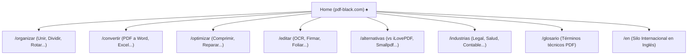

# SEO & Organic Positioning Engineering Mastery for PDFBlack ♠️

Esta skill dota al agente de metodología de élite, directrices técnicas y flujos de diagnóstico en vivo para posicionar **PDFBlack** (`https://pdf-black.com`) en las primeras posiciones de Google Search frente a competidores establecidos (iLovePDF, Smallpdf, PDF24, Adobe).

---

## 1. El Posicionamiento Único de PDFBlack (USP SEO)

En el mercado saturado de herramientas PDF, competir únicamente por "unir pdf" por volumen bruto es lento debido al alto Domain Authority histórico de los incumbentes. La ventaja competitiva de PDFBlack que debe explotarse en toda la arquitectura On-Page y de Contenido es:

1. **Privacidad Absoluta (Zero-Knowledge / Client-Side):**
   * *Palabras clave y ganchos:* "sin subir archivos", "100% privado en tu navegador", "cumple RGPD / HIPAA", "seguro para documentos confidenciales".
   * *Diferenciador:* Los competidores suben los archivos a sus servidores en la nube; PDFBlack procesa en memoria RAM local mediante Web Workers y WebAssembly.
2. **Sin Límites Artificiales ni Paywalls:**
   * *Palabras clave y ganchos:* "sin límite de tamaño", "archivos pesados 100MB+", "gratis sin registro", "sin marcas de agua", "sin límites por hora".
3. **Casos de Uso Especializados de Alto Valor (Nicho Profesional):**
   * Índices corporativos automáticos (TOC), numeración Bates para juzgados/notarías, modo dúplex para imprenta, conversión vectorial sin pérdida ISO 32000-1.

---

## 2. Estándares Técnicos en Next.js App Router

Toda ruta pública indexable en `app/` debe cumplir estrictamente esta arquitectura:

### A. Metadatos Centralizados con la Metadata API
* **Ubicación:** Todo archivo `page.tsx` con directiva `'use client'` **debe** ir acompañado de un `layout.tsx` en su mismo directorio que exporte el objeto `Metadata`.
* **Uso del Registro Global:** Consumir siempre `buildToolMetadata(categoria, herramienta, idioma)` desde `@/lib/seo-metadata.ts` para garantizar consistencia de títulos, descripciones, Open Graph y canonicals:

```typescript
// app/categoria/herramienta/layout.tsx
import type { Metadata } from 'next';
import { buildToolMetadata } from '@/lib/seo-metadata';

export const metadata: Metadata = buildToolMetadata('categoria', 'herramienta', 'es');

export default function ToolLayout({ children }: { children: React.ReactNode }) {
  return <>{children}</>;
}
```

### B. Estándar de Titles y Meta Descriptions
* **`<title>`:** Longitud óptima entre 50 y 60 caracteres. Fórmula calibrada:
  `[Verbo de Acción + Keyword Principal] — [Beneficio / USP Diferencial] | PDFBlack`
  * *Ejemplo óptimo:* `Unir PDF Gratis Online — Sin Límites de Tamaño ni Registro | PDFBlack`
* **`meta description`:** Longitud óptima entre 140 y 155 caracteres. Debe incluir llamada a la acción clara, mención al procesamiento privado local y resolver la intención de búsqueda.

### C. URLs Canónicas y Enlaces Alternativos Hreflang
Cada página debe declarar explícitamente su canonical absoluta y su contraparte bilingüe:
```typescript
alternates: {
  canonical: 'https://pdf-black.com/organizar/unir',
  languages: {
    'es': 'https://pdf-black.com/organizar/unir',
    'en': 'https://pdf-black.com/en/merge-pdf',
    'x-default': 'https://pdf-black.com/organizar/unir',
  },
}
```

---

## 3. Dominación de Rich Snippets y Posición Cero (Schema.org JSON-LD)

Para capturar la mayor cuota de clics (CTR) en las SERPs, cada herramienta de PDFBlack debe inyectar cuatro tipos de datos estructurados validados mediante `<script type="application/ld+json">`:

### 1. `WebApplication` / `SoftwareApplication`
Declara la herramienta como una aplicación web nativa gratuita:
```json
{
  "@context": "https://schema.org",
  "@type": ["WebApplication", "SoftwareApplication"],
  "name": "Unir PDF Gratis Online | PDFBlack",
  "url": "https://pdf-black.com/organizar/unir",
  "applicationCategory": "UtilitiesApplication, BusinessApplication",
  "operatingSystem": "All (Windows, macOS, Linux, iOS, Android)",
  "browserRequirements": "Requires JavaScript. Requires HTML5 Canvas and WebAssembly/Web Workers.",
  "offers": {
    "@type": "Offer",
    "price": "0",
    "priceCurrency": "USD"
  },
  "aggregateRating": {
    "@type": "AggregateRating",
    "ratingValue": "4.9",
    "reviewCount": "2150",
    "bestRating": "5",
    "worstRating": "1"
  }
}
```

### 2. `FAQPage`
Diseñado para activar los acordeones de preguntas frecuentes en Google y resolver consultas "People Also Ask" (PAA).
* Mínimo 8-10 preguntas altamente técnicas y orientadas al usuario (privacidad, límites, calidad vectorial, compatibilidad móvil, formatos).

### 3. `HowTo`
Estructura tutorial paso a paso con `HowToStep` para capturar fragmentos enriquecidos de instrucciones.

### 4. `BreadcrumbList`
Jerarquía de navegación semántica clara (`Inicio` $\rightarrow$ `Categoría` $\rightarrow$ `Herramienta`).

---

## 4. Diagnóstico y Optimización con Servidores MCP en Vivo

El agente tiene acceso directo a herramientas de telemetría y diagnóstico en vivo. Debe utilizarlas en los siguientes escenarios:

### A. Auditoría con Google Search Console MCP (`google-search-console`)
* **Propiedad configurada:** `sc-domain:pdf-black.com`
* **Herramientas disponibles:**
  1. `query_search_analytics`:
     * *Estrategia "Low-Hanging Fruits":* Consultar páginas o consultas con altas impresiones pero bajo CTR (`ctr < 5%`) o posición media entre 5 y 15. Esas son las candidatas prioritarias para reescribir sus títulos y descripciones y duplicar clics en 48 horas.
     * *Detección de canibalización:* Verificar si dos URLs distintas compiten por la misma `query`.
  2. `inspect_url`:
     * Inspeccionar el estado de indexación de URLs recién creadas o actualizadas, verificando si Googlebot las reconoció o reporta errores de rastreo.
  3. `list_sitemaps` y `submit_sitemap`:
     * Validar que el sitemap oficial (`https://pdf-black.com/sitemap.xml`) no tenga errores ni advertencias de descarga.

### B. Análisis de Comportamiento con Google Analytics MCP (`google-analytics`)
* **Propiedad configurada:** `properties/548228704`
* **Herramientas disponibles:**
  1. `get_traffic_overview`: Analizar la evolución del canal `Organic Search` frente a `Direct` y `Referral`.
  2. `get_top_pages`: Identificar las rutas que más tiempo de permanencia y engagement retienen para potenciar el enlazado interno desde ellas hacia herramientas nuevas.

### C. Inspección Renderizada con Puppeteer y Fetch
* **Fetch (`read_url_content` o MCP fetch):** Verificación instantánea de cabeceras HTTP, código de respuesta `200 OK`, `X-Robots-Tag` y accesibilidad de `robots.txt` y `sitemap.xml`.
* **Puppeteer / Browser:** Inspeccionar que el DOM renderizado por React contenga las etiquetas canónicas correctas, que no existan headings vacíos y que no se bloquee el First Contentful Paint.

---

## 5. Arquitectura de Silos y SEO Programático

PDFBlack estructura su autoridad temática en silos interconectados mediante enlaces contextuales:



### Reglas de Enlazado Interno:
1. Toda página de herramienta debe contener un componente de soluciones relacionadas (`RelatedLongTailSolutions` o links contextuales a la misma categoría).
2. Los enlaces nunca deben usar textos ancla genéricos ("clic aquí"). Deben usar textos ancla descriptivos ("unir archivos PDF", "convertir PDF a Word editable").
3. El silo en inglés (`/en/...`) debe vincularse exclusivamente entre páginas en inglés, utilizando siempre las etiquetas `hreflang` para la correlación idiomática.

---

## 6. Checklist de Validación Prevuelo para Nuevas Páginas

Antes de considerar concluida la creación o refactorización de cualquier ruta pública:
- [ ] ¿Existe el archivo `layout.tsx` con su `metadata` correspondiente?
- [ ] ¿Está registrada la metadata en `lib/seo-metadata.ts` con versiones `es` y `en`?
- [ ] ¿La URL canónica es absoluta y utiliza HTTPS?
- [ ] ¿Se inyectaron los schemas JSON-LD (`WebApplication`, `FAQPage`, `BreadcrumbList`, `HowTo`)?
- [ ] ¿Hay exactamente un único encabezado `<h1>` semántico por página?
- [ ] ¿Las imágenes cuentan con atributo `alt` relevante y no genérico?
- [ ] ¿La nueva ruta está incluida o permitida en `next-sitemap.config.js`?
- [ ] ¿La página mantiene una puntuación estimada de Core Web Vitals verde (LCP < 2.5s, CLS < 0.1, INP < 200ms) ejecutando operaciones pesadas en Web Workers?
